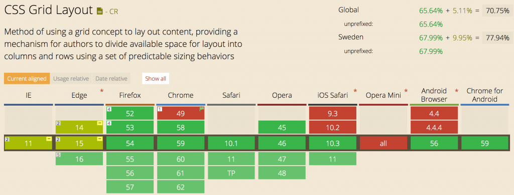
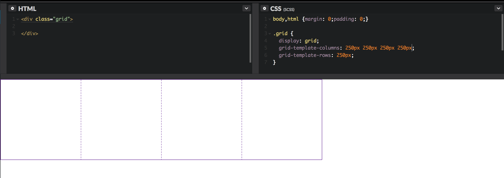
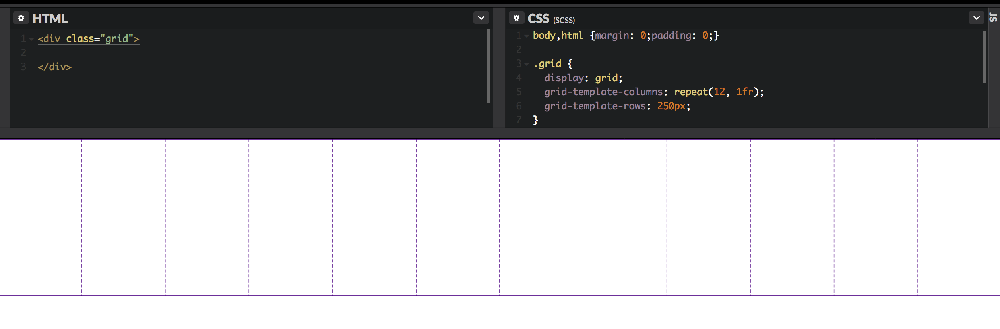
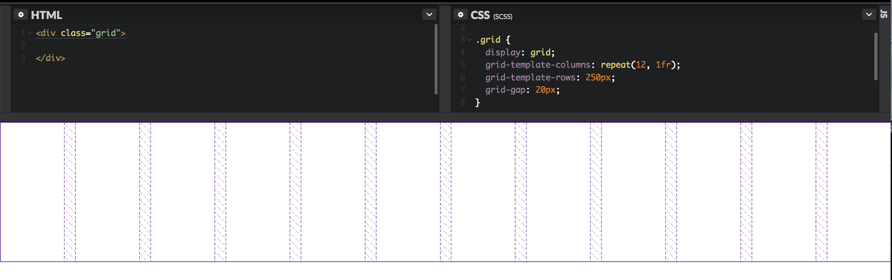
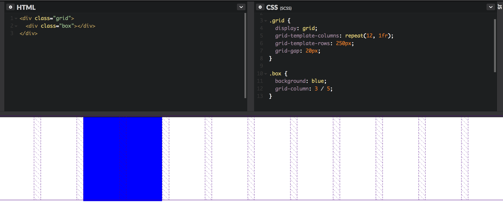
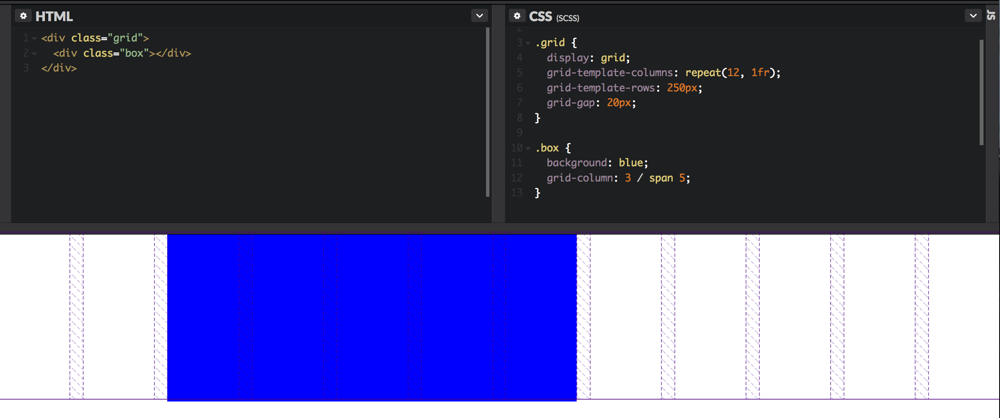
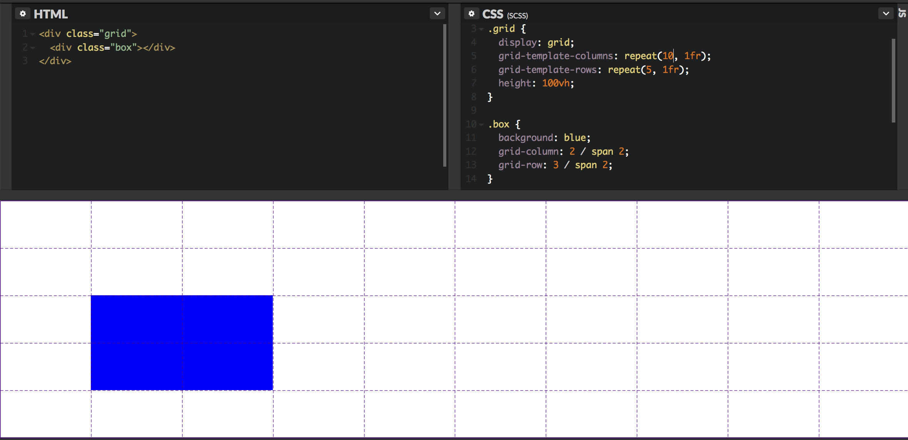
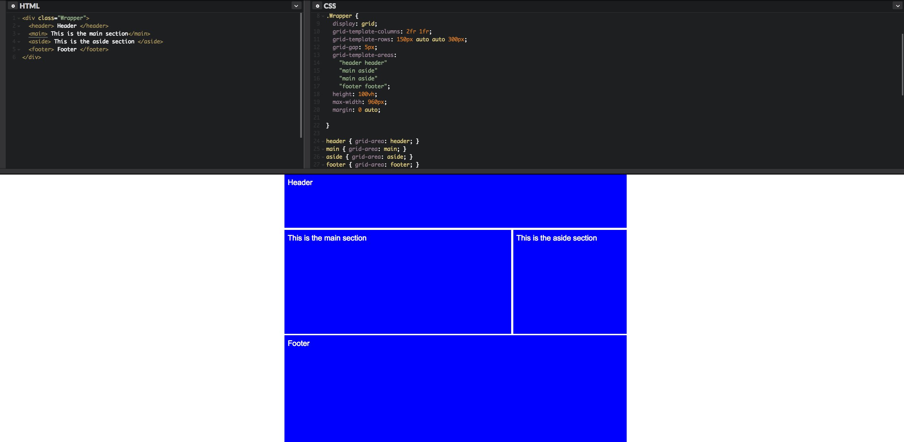

It's time to dive into the [CSS grid layout](https://developer.mozilla.org/en-US/docs/Web/CSS/CSS_Grid_Layout). All the modern browsers support it, and Microsoft is [working](https://developer.microsoft.com/en-us/microsoft-edge/platform/status/gridupdate/?q=grid%20update) on the implementation for IE and Edge. I would like to give you a short introduction to help you understand how grid works and to show you how easy it is to get started with.

**The current support for CSS Grid Layout. Date 1 Jul 2017**

## Define a basic grid

`display: grid`. This is the new property value that would be set on the container element where you would want your grid to be established.

Let's set up the columns for this grid. You can set the width of every column by `grid-template-columns`, which also sets the total number of columns for one row. In this case I will create a four-column layout with a width of 250px for each column.

`grid-template-columns: 250px 250px 250px 250px`

Now we must define the rows of the grid using the `grid-template-rows` property. We will set that to 250px, which will be the height of this one row.

**Hot tip: Firefox has [implemented](https://developer.mozilla.org/en-US/docs/Tools/Page_Inspector/How_to/Examine_grid_layouts) a grid overlay representation for the inspector when inspecting a grid layout. My screenshots use the Firefox overlay.**

You can watch the video here https://www.youtube.com/embed/lzjIe-8WhiQ

### New unit for grid (fr)

Let's make this a little bit more exciting. We can define a twelve-equal column layout without having to calculating the math for it. We will be using a new unit called `fr`. `fr` is short for fraction, and it's a grid unit that assigns track of the *available space* in the container. It's like`flex-grow` for flexbox. Let's use that to display the twelve equal width columns for a row with the [repeat](https://developer.mozilla.org/en-US/docs/Web/CSS/repeat) function for the grid.

### Grid gutter

You can also add a gutter to the grid by using the `grid-gap` property. `grid-gap` is shorthand for `grid-row-gap` and `grid-column-gap`. We will set that to 20px to define our gutters for this grid.

### Grid column

Let’s position something within this grid. We can create a child element `
` and place it using `grid-column: start / end` in this grid. In this case I can start with column row number 3 and end before column row number 5 using `grid-column: 3 / 5`.

There is also another easier way to define the width of that box, by defining a span. The span will regulate how many columns are filled. In this example, it would be five grid cells adding span to the end row. `grid-column: 3 / span 5`

### Grid row

You can also define the position of the starting grid row. `grid-row: start / end` Here is another example of how that works with multiple rows in the grid.

** *Note:* the display grid property only affects one depth down the document tree. You can always define a new grid down the tree (nested grids) or use the `display: subgrid`  property, which will copy the columns and rows from its parent grid without having to redefine the same values.**

### Grid template areas

With the grid, you can also create references for your cells, sort of like a map representation to apply grid areas called `grid-template-areas`. I’ve created a [demo](https://codepen.io/marcustisater/pen/mwxwMG) to present a typical example.

So, for each element you need to specify the area where it will be positioned. In this case I would say `header { grid-area: header }` and that would place by the header reference. The dot (.) represents none and will leave a position empty.

Now you have a understanding of what grid is and how powerful it is. If you would like to deep dive into grid which I think you should do. *Look future down for more reading.*

## The flexbox vs grid dilema 🤔

Some developers have trouble understanding the difference between flexbox and grid. Simply put, flexbox is not grid, and grid is not flexbox. Grid is for establishing a layout, while flexbox is for flexing content within a box vertically or horizontally.

## Accessibility

I think there is going to be a problem with accessibility. We have to be responsible for how we layout elements within a grid layout. Remember that we are not moving things in the DOM.

## Old browsers!? 😱

So, what about old browsers? I think we have to accept that not everything will look the same for all browsers. Building a layout without the grid would be a great fallback for starters. You can also use `@support` to check if grid is supported and go from there. *Let me know* if you have any other suggestions for how to deal with old browsers.

## More links and resources to master grid 😎

There is so much more to learn about grid. You should deep dive into these resources.

* [Grid by example](https://gridbyexample.com/), Rachel Andrews official documentation on grid.
* [CSS Grid Garden](https://cssgridgarden.com), a CSS game to boost your grid skills
* [The complete guide](https://css-tricks.com/snippets/css/complete-guide-grid/) to the grid spec by CSS-Tricks
* Great talk on CSS Grid http://wordpress.tv/2017/06/30/morten-rand-hendriksen-css-grid-changes-everything-about-web-layouts/
